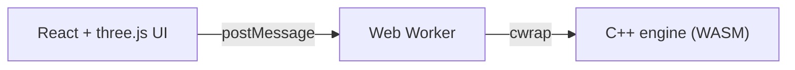

# Rubiks Solutions

Solve any Rubik's cube in the browser: a 3D cube driven by a C++ solver compiled to WebAssembly.

**Live:** https://rubiks.solutions



## Solvers

| Method | Approach | Avg moves | Avg time |
|---|---|---|---|
| Optimal | Kociemba two-phase with pruning tables | 19.1 | 60 ms |
| CFOP | Optimal cross, F2L pair search, 57 OLL + 21 PLL cases | 54.4 | 0.2 ms |
| Beginner | Layer by layer from the D face, 7 stages | 140.1 | 0.1 ms |

Measured by `ctest` on random scrambles (120 optimal, 600 CFOP and beginner), native build on an Apple Silicon Mac. Optimal table setup takes about 0.4 s once.

## Run

```sh
cd web && npm install && npm run dev
```

`web/src/wasm/quickcube.js` is committed, so the app runs without Emscripten.

## Build and test

```sh
cmake -S engine -B engine/build && cmake --build engine/build -j
ctest --test-dir engine/build
engine/build_wasm.sh
cd web && npm test && npm run build
```

## Keys

`U R F D L B` turn a face, `Shift` reverses, `Backspace` undoes, `Space` plays or pauses, arrows step. `?` or the help icon opens a short handbook.

## Layout

- `engine/` C++17 solvers, `qc` CLI, native tests
- `web/` Vite, React, react-three-fiber
- `docs/CONTRACT.md` engine to web interface

## Deploy

Pushes to `main` test, build and deploy to GitHub Pages at https://rubiks.solutions.

- Repo Settings > Pages: source is GitHub Actions, custom domain `rubiks.solutions`, enforce HTTPS.
- `web/public/CNAME` holds the domain and Vite builds with `base: '/'`.
- DNS for the apex: `A` records `185.199.108.153`, `185.199.109.153`, `185.199.110.153`, `185.199.111.153` and `AAAA` records `2606:50c0:8000::153`, `2606:50c0:8001::153`, `2606:50c0:8002::153`, `2606:50c0:8003::153`. Add `CNAME www -> mohsensc.github.io` so `www` redirects to the apex.
